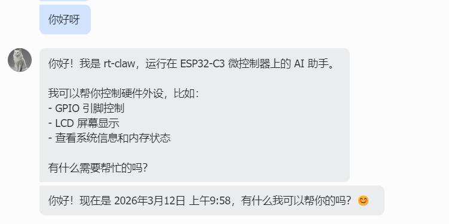

# One Dollar Hardware, One AI Lobster?

An ESP32-C3 that costs less than a dollar. 160 MHz clock, 400 KB RAM — running AI on this?

We did it. Meet RT-Claw (Real-Time Claw) — an AI lobster living on an embedded chip.


**RT-Claw** is an AI assistant that runs on embedded RTOS. No GPU, no Linux, no real hardware needed — a plain QEMU emulator on your laptop gives you the full experience.

## What Can It Do?

RT-Claw atomizes hardware capabilities — GPIO, sensors, LCD display, networking — into "tools" that an LLM dynamically orchestrates. Just describe what you want in natural language, and the AI decides which hardware to call and in what order.

Tell it to "draw a lobster", and it chains lcd_circle, lcd_line, lcd_rect and other drawing tools to create art on a 320x240 screen:


Don't feel like chatting over a serial terminal? Connect Feishu (Lark) and talk to your embedded device from your phone:



Ask for system status, and it invokes system_info and memory_info tools on its own, reporting chip model, uptime, and memory usage:


Setting a scheduled task is just one sentence away:


## Technical Highlights

- **Multi-RTOS**: Same codebase runs on FreeRTOS and RT-Thread with zero changes via OSAL
- **Compile-time strippable**: Every module (Shell, LCD, swarm, scheduler, each tool group) toggles independently via menuconfig, fitting hardware from 256 KB to 4 MB
- **Tool Use**: 13 built-in tools covering GPIO control, system monitoring, LCD drawing, and scheduled tasks — the LLM orchestrates them autonomously via function calling
- **Swarm Intelligence**: UDP heartbeat discovers other nodes on the LAN, laying the groundwork for multi-device collaboration
- **IM Integration**: Feishu long connection, no public IP required — the device is online the moment it boots

## Three Steps to Start

```bash
# 1. One-line toolchain setup
./tools/setup-esp-env.sh

# 2. Pick a config preset
cd platform/esp32c3
cp sdkconfig.defaults.demo sdkconfig.defaults

# 3. Set your API key, build, and run
idf.py set-target esp32c3
idf.py menuconfig    # Set your LLM API Key
idf.py build && idf.py qemu monitor
```

No dev board? No problem — QEMU provides full-featured emulation at zero cost.

## Join Us

RT-Claw is just getting started. There's so much more to build: multi-model API support, a web config portal, more IM channels, more hardware platforms. If embedded AI excites you, come join in:

- **GitHub**: [github.com/zevorn/rt-claw](https://github.com/zevorn/rt-claw)
- **Gitee**: [gitee.com/zevorn/rt-claw](https://gitee.com/zevorn/rt-claw)
- **QQ Group**: [GTOC Community](https://qm.qq.com/q/heSPPC9De8)
- **Telegram**: [GTOC Channel](https://t.me/gevico_channel)

A Star is the best support you can give.
